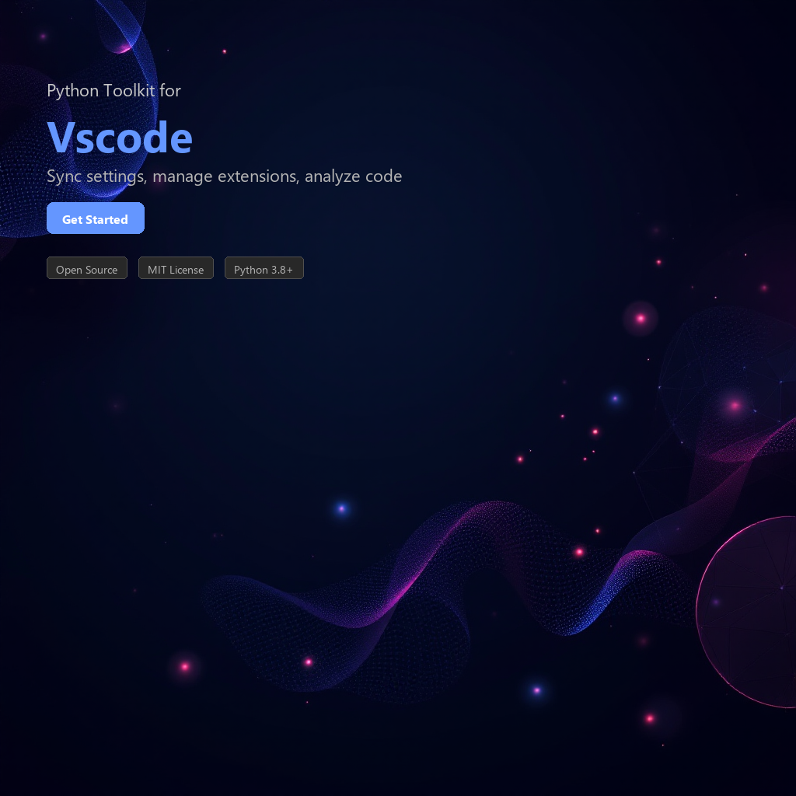

# vscode-toolkit




[](https://www.python.org/downloads/)
[](https://pypi.org/project/vscode-toolkit/)
[](https://opensource.org/licenses/MIT)
[](https://github.com/psf/black)

## Overview

**vscode-toolkit** is a Python library for programmatically managing Visual Studio Code settings, configurations, and workspace analysis. It simplifies configuration synchronization across machines, provides insights into your workspace structure, and enables automation of common IDE tasks.

## Features

- **Settings Management** - Read, modify, and persist VS Code user and workspace settings
- **Configuration Sync** - Export and import settings across different machines or repositories
- **Workspace Analysis** - Analyze project structure, extensions, and code metrics
- **Extension Management** - Query and manage installed extensions programmatically
- **Launch Configuration** - Create and validate VS Code launch configurations
- **Multi-Platform Support** - Works seamlessly on Windows, macOS, and Linux
- **JSON Schema Validation** - Validate settings against VS Code schemas
- **Profile Management** - Handle multiple VS Code profiles and their configurations

## Installation

### Via pip (Recommended)

```bash
pip install vscode-toolkit
```

### From Source

```bash
git clone https://github.com/yourusername/vscode-toolkit.git
cd vscode-toolkit
pip install -e .
```

### Development Installation

```bash
git clone https://github.com/yourusername/vscode-toolkit.git
cd vscode-toolkit
pip install -e ".[dev]"
```

## Quick Start

```python
from vscode_toolkit import VSCodeManager

# Initialize the manager
manager = VSCodeManager()

# Load current settings
settings = manager.load_settings()

# Modify a setting
settings.set('editor.fontSize', 14)
settings.set('editor.tabSize', 2)

# Save changes
manager.save_settings(settings)

print("Settings updated successfully!")
```

## Usage Examples

### 1. Managing User Settings

```python
from vscode_toolkit import VSCodeManager, SettingsLevel

manager = VSCodeManager()

# Load user-level settings
user_settings = manager.load_settings(level=SettingsLevel.USER)

# Access specific settings
font_size = user_settings.get('editor.fontSize', default=12)
theme = user_settings.get('workbench.colorTheme', default='Default Dark+')

print(f"Current font size: {font_size}")
print(f"Current theme: {theme}")

# Update multiple settings at once
updates = {
    'editor.fontSize': 14,
    'editor.tabSize': 2,
    'editor.formatOnSave': True,
    'python.linting.enabled': True,
}

user_settings.update(updates)
manager.save_settings(user_settings, level=SettingsLevel.USER)
```

### 2. Syncing Configurations

```python
from vscode_toolkit import ConfigurationSync
import json

# Export current configuration
sync = ConfigurationSync()
config_export = sync.export_configuration(
    include_extensions=True,
    include_keybindings=True,
    include_snippets=False
)

# Save to file
with open('vscode-config.json', 'w') as f:
    json.dump(config_export, f, indent=2)

# Import configuration on another machine
with open('vscode-config.json', 'r') as f:
    config_import = json.load(f)

sync.import_configuration(config_import)
print("Configuration synced successfully!")
```

### 3. Workspace Analysis

```python
from vscode_toolkit import WorkspaceAnalyzer

analyzer = WorkspaceAnalyzer(workspace_path='/path/to/project')

# Get workspace structure
structure = analyzer.analyze()

print(f"Total files: {structure.file_count}")
print(f"Total directories: {structure.directory_count}")
print(f"Languages detected: {structure.detected_languages}")

# Get extension recommendations
recommendations = analyzer.get_extension_recommendations()
for ext in recommendations:
    print(f"Recommended: {ext.name} ({ext.publisher})")

# Analyze code statistics
stats = analyzer.get_code_statistics()
for lang, info in stats.items():
    print(f"{lang}: {info['lines']} lines, {info['files']} files")
```

### 4. Managing Extensions

```python
from vscode_toolkit import ExtensionManager

ext_manager = ExtensionManager()

# List all installed extensions
installed = ext_manager.get_installed_extensions()
for ext in installed:
    print(f"{ext.name} v{ext.version}")

# Check for extension updates
updates_available = ext_manager.check_updates()
print(f"Updates available: {len(updates_available)}")

# Get extension recommendations for a project
recommendations = ext_manager.get_recommendations_for_project('/path/to/project')
print(f"Recommended extensions:\n{recommendations}")
```

### 5. Configuring Debug Launches

```python
from vscode_toolkit import LaunchConfigBuilder

builder = LaunchConfigBuilder()

# Create Python debug configuration
python_config = builder.python_config(
    name="Python: Current File",
    program="${file}",
    console="integratedTerminal",
    justMyCode=True
)

# Create Node.js debug configuration
node_config = builder.node_config(
    name="Node: Launch Program",
    program="${workspaceFolder}/index.js",
    restart=True,
    protocol="inspector"
)

# Save configurations
builder.save_launch_config([python_config, node_config])
print("Launch configurations created!")
```

### 6. Profile Management

```python
from vscode_toolkit import ProfileManager

profile_mgr = ProfileManager()

# List available profiles
profiles = profile_mgr.list_profiles()
for profile in profiles:
    print(f"Profile: {profile.name} (Location: {profile.path})")

# Export a profile
profile_export = profile_mgr.export_profile('Default')
with open('my-profile.json', 'w') as f:
    json.dump(profile_export, f, indent=2)

# Switch to a different profile
profile_mgr.switch_profile('Work Setup')
print("Switched to 'Work Setup' profile")
```

## Requirements

| Requirement | Version | Notes |
|-------------|---------|-------|
| Python | 3.8+ | Core language requirement |
| requests | 2.28.0+ | HTTP library for API calls |
| pyyaml | 6.0+ | Configuration file parsing |
| jsonschema | 4.0+ | JSON schema validation |
| pathlib2 | 2.3.5+ | Enhanced path handling (Python 3.8) |

## Platform Support

| Platform | Status | Notes |
|----------|--------|-------|
| Windows | ✅ Supported | Tested on Windows 10/11 |
| macOS | ✅ Supported | Tested on Big Sur+ |
| Linux | ✅ Supported | Ubuntu 18.04+ verified |

## Configuration File Locations

The toolkit automatically detects VS Code configuration based on your operating system:

- **Windows**: `%APPDATA%\Code\User\settings.json`
- **macOS**: `~/Library/Application Support/Code/User/settings.json`
- **Linux**: `~/.config/Code/User/settings.json`

## Contributing

We welcome contributions! Please follow these steps:

1. Fork the repository
2. Create a feature branch (`git checkout -b feature/amazing-feature`)
3. Commit your changes (`git commit -m 'Add amazing feature'`)
4. Push to the branch (`git push origin feature/amazing-feature`)
5. Open a Pull Request

### Development Setup

```bash
git clone https://github.com/yourusername/vscode-toolkit.git
cd vscode-toolkit
pip install -e ".[dev]"
pytest  # Run tests
black .  # Format code
flake8 .  # Lint code
```

### Testing

```bash
pytest tests/ -v
pytest tests/ --cov=vscode_toolkit  # With coverage
```

## Troubleshooting

**Settings not persisting?**
- Ensure VS Code is closed when saving settings programmatically
- Check file permissions on the settings.json file

**Extensions not detected?**
- Verify VS Code installation path is correctly identified
- Check that extensions are properly installed in VS Code

**Configuration sync failing?**
- Validate JSON format before importing
- Ensure compatibility between VS Code versions

## License

This project is licensed under the MIT License - see the [LICENSE](LICENSE) file for details.

## Acknowledgments

- Built for developers who want to automate their VS Code workflows
- Inspired by the VS Code Settings Sync feature
- Thanks to the VS Code community for excellent documentation

---

**Need help?** Check the [documentation](docs/) or open an [issue](https://github.com/yourusername/vscode-toolkit/issues).